# Attendance and Salary Employee CRM Android App

## Overview
The Attendance and Salary Employee CRM app is a comprehensive solution designed to streamline the management of employee attendance, salary, and various HR-related tasks. This application aims to enhance productivity and efficiency within organizations by providing an intuitive user interface and essential functionalities. 

## Features

### Initial Screens

1. **Welcome Screen**
   - **Description:** A brief introduction to the app, highlighting its purpose and benefits.
   - **Action:** A "Get Started" button to proceed to the login screen.


   <div style="display: flex; justify-content: center; gap: 40px; padding: 20px;">
      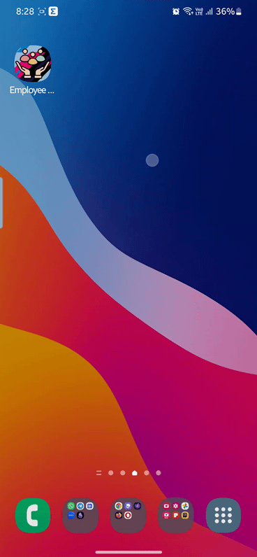  
      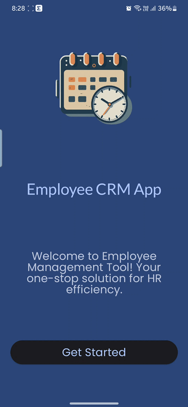
   </div>
   
2. **Login Screen**
   - **Description:** Secure login for employees and administrators.
   - **Success Action:** On successful login, the user is redirected to the main employee list screen.
   - **Error Handling:** Displays an error message on unsuccessful login attempts.

   <div style="display: flex; justify-content: center; gap: 40px; padding: 20px;">
      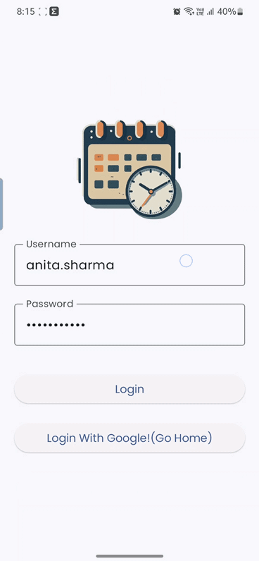  
      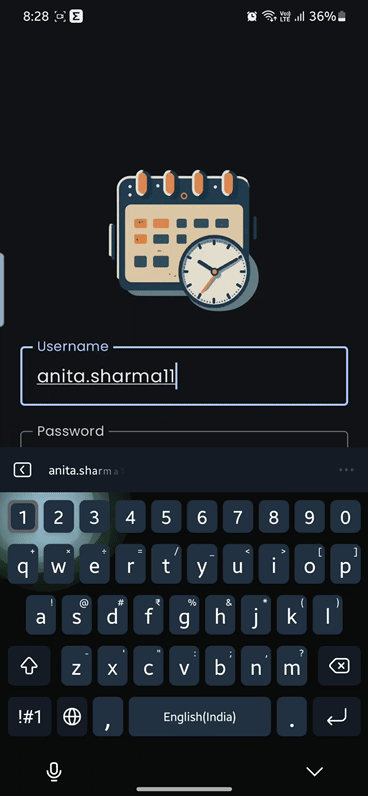  
   </div>
   <div style="display: flex; justify-content: center; gap: 40px; padding: 20px;">
      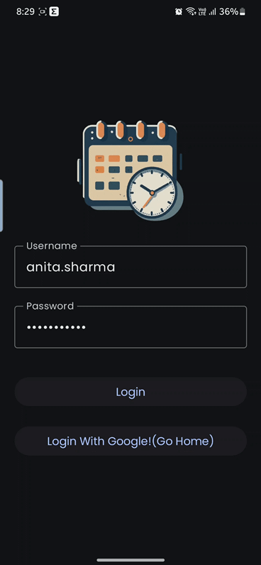
   </div>

### Main Screens

1. **Employee List Screen**
   - **Content:** Displays a list of employees with the following details:
     - Employee Name
     - Employee ID
     - Attendance Status (e.g., "Present", "Absent", "On Leave")
     - Salary Status (e.g., "Paid", "Pending")

   <div style="display: flex; justify-content: center; gap: 40px; padding: 20px;">
      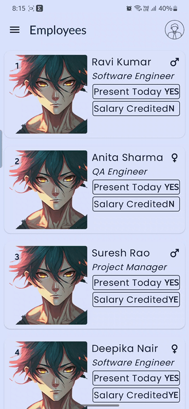  
      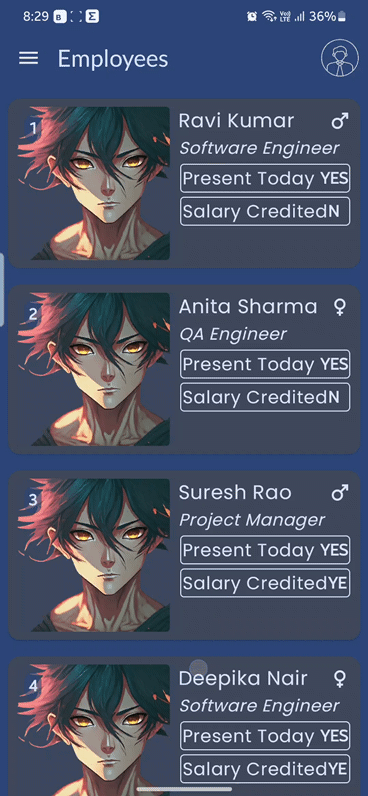
   </div>

2. **Employee Profile Screen**
   - **Content:** Provides detailed information about the selected employee, including:
     - Name
     - ID
     - Department
     - Designation
     - Contact Information
     - Attendance Details
     - Salary Details
   - **Actions:**
     - Buttons for marking attendance
     - A button to view or edit salary details
   - **Additional Features:**
     - Employee Photo
     - Performance Reviews

   <div style="display: flex; justify-content: center; gap: 40px; padding: 20px;">
        
      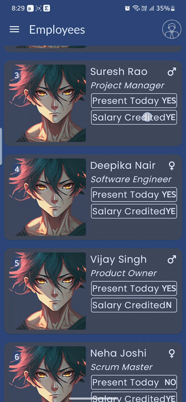
   </div>

3. **Attendance History Screen**
   - **Content:** Displays a detailed view of an employee's attendance history, including:
     - Date
     - Attendance Status
     - Remarks (if any)

   <div style="display: flex; justify-content: center; gap: 40px; padding: 20px;">
      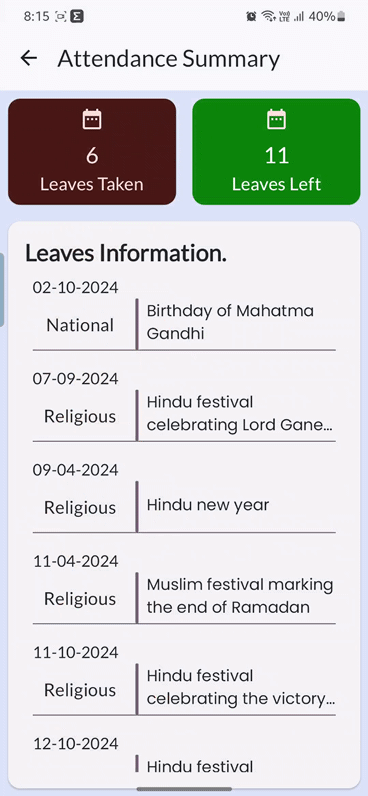  
      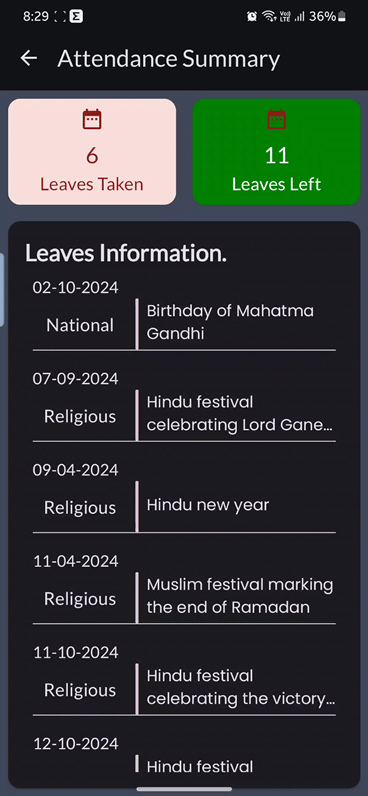
   </div>

4. **Salary Details Screen**
   - **Content:** Offers a breakdown of an employee's salary, including:
     - Basic Salary
     - Allowances
     - Deductions
     - Net Pay
   - **Additional Features:**
     - Salary History
     - Tax Calculations

   <div style="display: flex; justify-content: center; gap: 40px; padding: 20px;">
      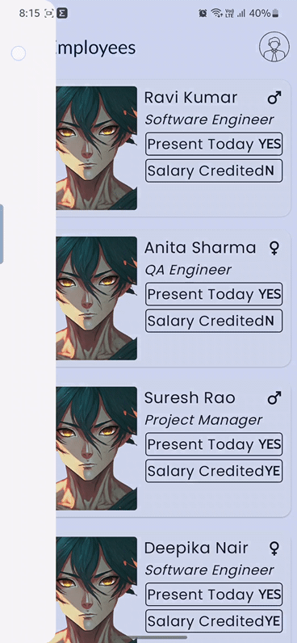  
      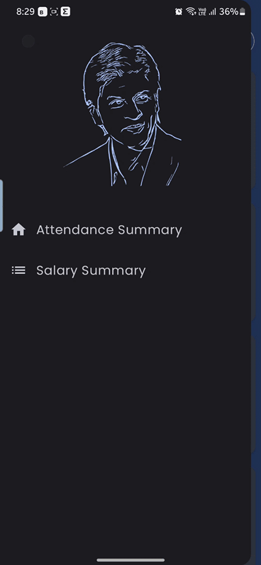
   </div>

5. **Logout from App**
   - **Action:** Allows users to securely log out from the application.

   <div style="display: flex; justify-content: center; gap: 40px; padding: 20px;">
      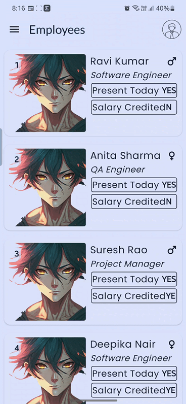  
      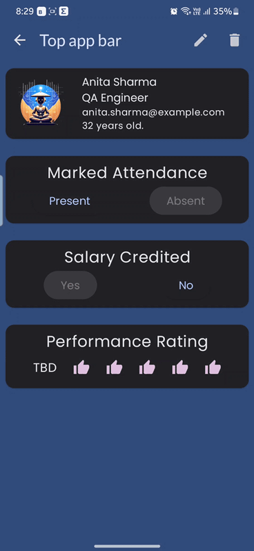
   </div>

## Installation

To run the Attendance and Salary Employee CRM app locally, follow these steps:

1. **Clone the Repository**
   ```bash
   git clone https://github.com/yourusername/EmployeeCRMApp.git
   cd EmployeeCRMApp
   ```

2. **Open in Android Studio**
   - Open Android Studio and select `Open an existing project`.
   - Navigate to the cloned repository and open it.

3. **Build the Project**
   - Click on `Build` in the menu and select `Rebuild Project` to ensure all dependencies are set up correctly.

4. **Run the App**
   - Connect your Android device or start an Android emulator.
   - Click on the `Run` button in Android Studio to install the app on your device.

## Technologies Used

- **Programming Language:** 
  - Kotlin

- **Frameworks and Libraries:** 
  - Ktor for API calls
  - Jetpack Compose for UI development
  - Jetpack Navigation Component for navigation
  - Dagger Hilt for dependency injection
  - Room for local database management
  - Proto Data Store for caching

- **Project Structure:**
  - Multi-module architecture with separate modules for:
    - Network (API calls)
    - Storage (local database and caching)
    - Features (UI and business logic)

- **Architectural Pattern:**
  - MVVM (Model-View-ViewModel) pattern with:
    - Repository pattern
    - Use cases for business logic
    - Domain and data layers

- **Build System:**
  - Kotlin DSL instead of Gradle

- **Version Control:**
  - Git for version control

- **Backend Server:**
  - Built with Ktor, available at [Employee_CRM_Host](https://github.com/iamShekharGH/Employee_CRM_Host)

## Contribution Guidelines

Contributions to the Attendance and Salary Employee CRM app are welcome! Please follow these steps to contribute:

1. **Fork the Repository**
   - Click on the fork icon in the top right corner of the repository page.

2. **Create a New Branch**
   ```bash
   git checkout -b feature/YourFeatureName
   ```

3. **Make Your Changes**
   - Implement your feature or fix a bug.

4. **Commit Your Changes**
   ```bash
   git commit -m "Add your message describing the changes"
   ```

5. **Push to Your Fork**
   ```bash
   git push origin feature/YourFeatureName
   ```

6. **Create a Pull Request**
   - Navigate to the original repository and click on `New Pull Request`.

## Conclusion
The Attendance and Salary Employee CRM app is designed to provide HR departments with an efficient tool to manage employee-related tasks seamlessly. With user-friendly interfaces and robust features, this app can significantly enhance organizational productivity and employee satisfaction. 
