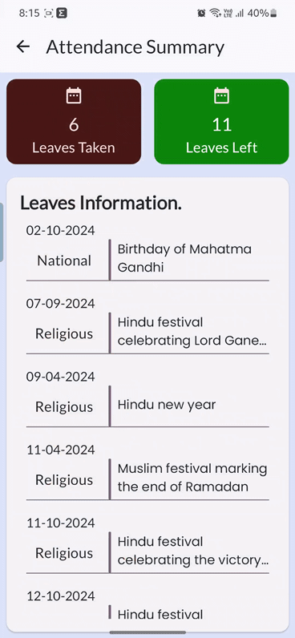

## Attendance and Salary Employee CRM Android App

**A comprehensive CRM app for managing employee attendance, salary, and other HR-related tasks.**

### Initial Screens:
1. **Welcome Screen:**
   * **Content:** A brief introduction to the app, its purpose, and benefits.
   * **Action:** A "Get Started" button to proceed to the login screen.
    
    |   |   |
    |---|---|

2. **Login Screen:**
   * **Action:** On successful login, redirects to the main employee list screen.
   * **Action:** On unsuccessful login, shows error.
    
|  |  |   
|--------------------------------------------------------------------|------------------------------------------------------------------|
    
|  |  |   
|--------------------------------------------------------------------|--------------------------------------------------------------------------------|

### Main Screens: 
1. **Employee List Screen:**
   * **Content:** A list of employees, each with:
     * Employee name
     * Employee ID
     * Attendance status (e.g., "Present", "Absent", "On Leave")
     * Salary status (e.g., "Paid", "Pending")

   |   |   |    
   |---|---|    

2. **Employee Profile Screen:**
   * **Content:** Detailed information about the selected employee:
     * Name
     * ID
     * Department
     * Designation
     * Contact information
     * Attendance details
     * Salary details
   * **Actions:**
     * Buttons to mark attendance
     * A button to view or edit salary details.
   * **Additional features:**
     * Employee photo   
     * Performance reviews

       |   |   |
       |---|---|

3. **Attendance History Screen:**
   * **Content:** A detailed view of an employee's attendance history, including:
     * Date
     * Attendance status
     * Remarks (if any)
     
      |   |   |
              |---|---|

4. **Salary Details Screen:**
   * **Content:** A breakdown of an employee's salary, including:
     * Basic salary
     * Allowances
     * Deductions
     * Net pay
   * **Additional features:**
     * Salary history
     * Tax calculations
     
      |   |   |
                     |---|---|

5. **Logout from App**

     |   |   |
                           |---|---|
